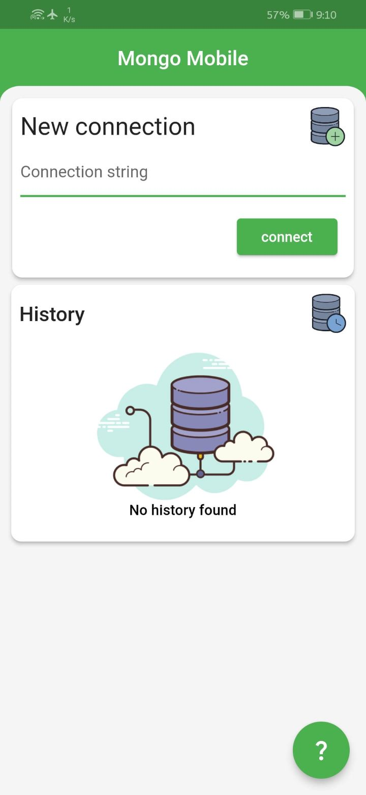
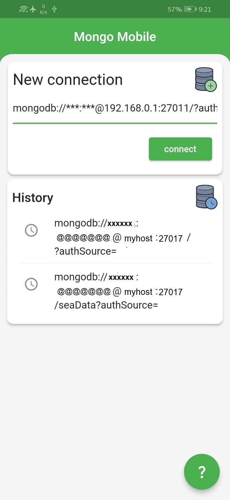
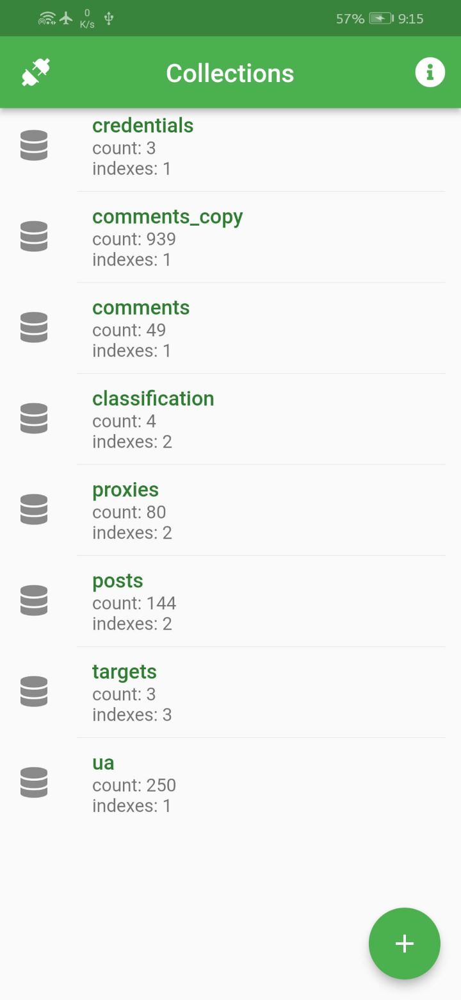
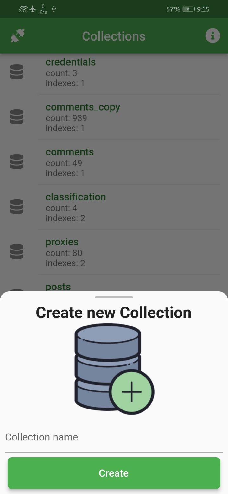
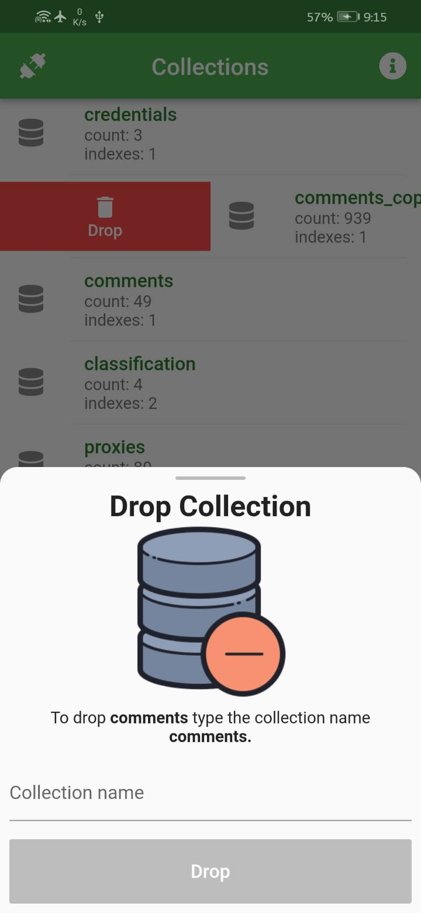
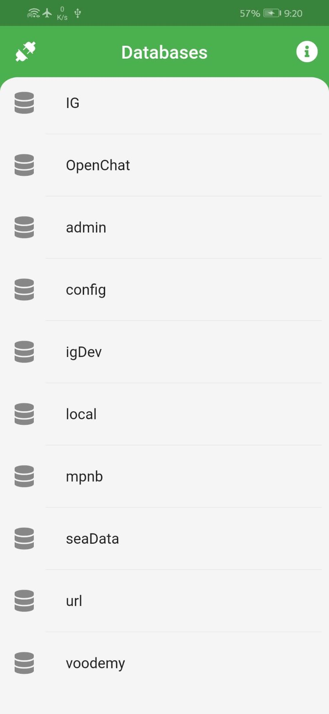
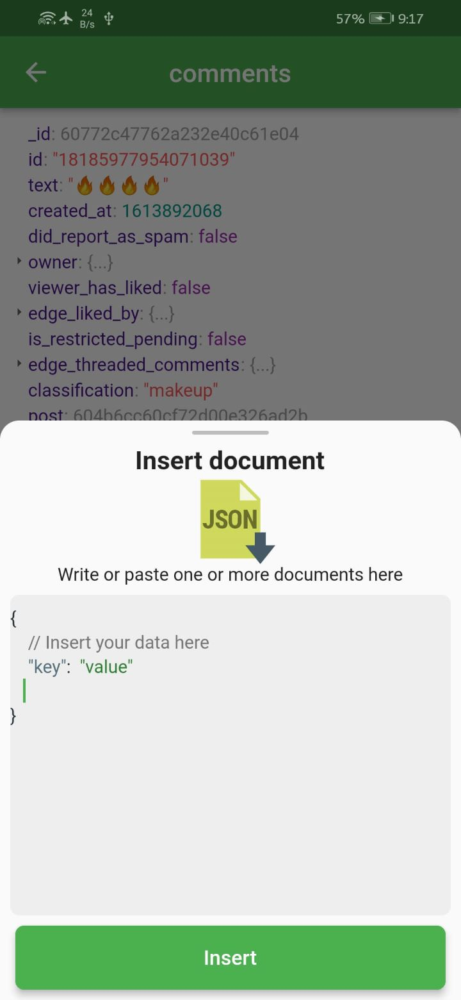
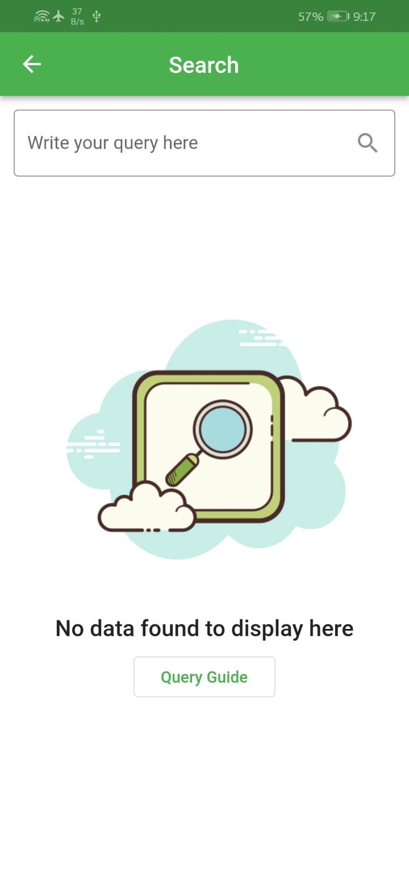
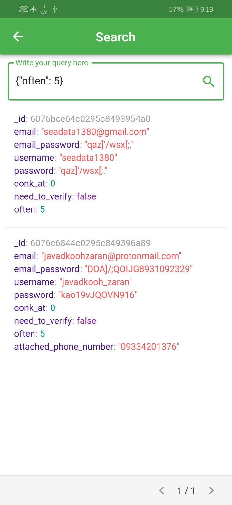

<div align="center" style="text-align:center">
<h1 align="center">Mongodb Mobile Client</h1>

</br>
<a href="https://github.com/Jamalianpour/mongo_mobile/license">
    
</a>
<a>
    
</a>
</div>

## Introduce

MongoDb Mobile is a free and open source client for mongodb database on android and ios platform write in flutter. due to flutter you can run this on desktop such as windows, linux and mac and web(not tested) but the target of this project is mobile.

## ✨ Features

- Connect to your mongodb with connection URI `mongodb://<username>:<password>@<hostname>:<port>`

  - support username and password
  - connect to specifics database by adding name to URI `mongodb://localhost:27017/dbname`

- Connection history
- Error handlings
- Display list of database on a mongodb
- Display installed mongodb information (version, isStandalone, ...)
- Display list of collections and theres info (total count, indexes)
- Display documents with pagination
- Create collection
- Drop collection
- Insert new documents
- Search with query
- ...

## 📸 Screenshots

| ConnectionPage                                 | ConnectionPage                                 |
| ---------------------------------------------- | ---------------------------------------------- |
|  |  |

| CollectionPage                             | CreateCollection                               |
| ------------------------------------------ | ---------------------------------------------- |
|  |  |

| DropCollection                             | DatabaseList                           |
| ------------------------------------------ | -------------------------------------- |
|  |  |

| DocumentPage                           | InsertDocument                             |
| -------------------------------------- | ------------------------------------------ |
|  |  |

| Search                               | Search                               |
| ------------------------------------ | ------------------------------------ |
|  |  |

## Usage

There is two way to use mongo_mobile:

### 1. Install apk

Install by last released apk in [release page](https://github.com/Jamalianpour/mongo_mobile/releases).

### 2. Clone project

At first clone project:

```git
git clone https://github.com/Jamalianpour/mongo_mobile.git
```

Then run with flutter command:

```sh
flutter run
```

---

Feel free to fork this repository and send pull request 🏁👍
